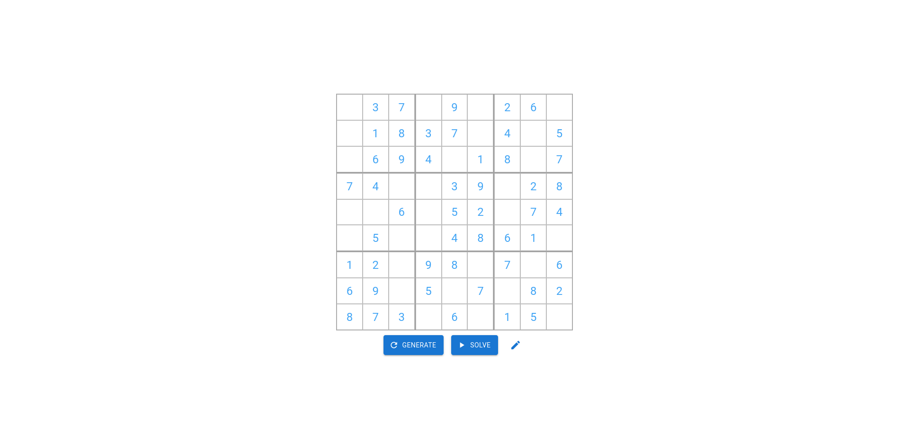

# Sudoku-TS: React TypeScript Sudoku WebApp

Sudoku-TS is a modern and intuitive Sudoku web application built using React, TypeScript, and Vite. It features a built-in solver to assist you in solving puzzles and utilizes the Material-UI (MUI) library for seamless and stylish UI components.



## Features

- **Interactive Sudoku Board:** Easily input and manage your Sudoku puzzle using a user-friendly interface.
- **Built-in Solver:** Stuck on a puzzle? No problem! Sudoku-TS comes with a powerful solver that can quickly find the solution for you.
- **Responsive Design:** Sudoku-TS is designed to work smoothly on a variety of devices, from desktops to mobile phones.
- **Material-UI Integration:** The app is styled using the popular Material-UI library, ensuring a clean and attractive design.

## Getting Started
Follow these steps to get Sudoku-TS up and running on your local machine:

1. **Clone the Repository:** Start by cloning this repository to your local machine using the following command:

```bash
git clone https://github.com/your-username/sudoku-ts.git
```

2. **Navigate to the Directory:** Move into the project directory:
```bash
cd sudoku-ts
```

3. **Install Dependencies:** Install the necessary dependencies using your preferred package manager. If you're using npm, run:
```bash
npm install
```

4. **Run the Development Server:** Start the development server to see the app in action. The following command will start the server and open the app in your default web browser:
```bash
npm run dev
```
